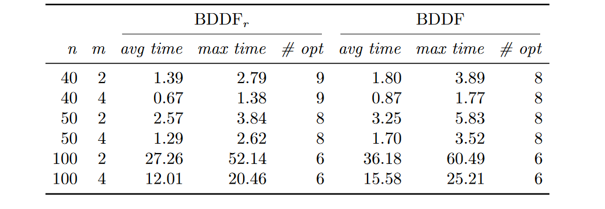

[](https://pubsonline.informs.org/journal/ijoc)

# A flow-based formulation for parallel machine scheduling using decision diagrams

This archive is distributed in association with the [INFORMS Journal on
Computing](https://pubsonline.informs.org/journal/ijoc) under the [MIT License](LICENSE).

The software and data in this repository are a snapshot of the software and data
that were used in the research reported on in the paper 
[This is a Template](https://doi.org/10.1287/ijoc.2019.0000) by T. Ralphs. 
The snapshot is based on [this SHA](https://github.com/tkralphs/JoCTemplate/commit/f7f30c63adbcb0811e5a133e1def696b74f3ba15) 
in the development repository. 

**Important: This code is being developed on an on-going basis at https://gitlab.kuleuven.be/u0056096/parallel-machine-bdd . Please go there if you would like to
get a more recent version or would like support**

## Cite

To cite the contents of this repository, please cite both the paper and this repo, using their respective DOIs.

Below is the BibTex for citing this snapshot of the repository.

```
@article{CacheTest,
  author =        {Daniel Kowalczyk, Roel Leus, Christopher Hojny, and Stefan R\o{}pke},
  publisher =     {INFORMS Journal on Computing},
  title =         {{A flow-based formulation for parallel machine scheduling
	using decision diagrams}},
  year =          {2023},
  doi =           {},
  url =           {},
}  
```

## Description
We present a new flow-based formulation for identical
parallel machine scheduling with a regular objective function and without idle time.
The formulation is constructed with the help of a decision diagram that represents all
job sequences that respect specific ordering rules.  These rules rely on a partition of the planning horizon into, generally
non-uniform, periods and do not exclude all optimal solutions,
but they constrain solutions to adhere to a canonical form.
The new formulation has numerous variables and constraints,
and hence we apply a Dantzig-Wolfe decomposition in order to compute the
linear programming relaxation in reasonable time; the resulting lower bound is stronger than
the bound from the classical time-indexed formulation. We develop a branch-and-price framework that solves
three instances from the literature for the first time.
We compare the new formulation with the time-indexed and arc-time-indexed
formulation by means of a series of computational experiments.

## Building
In the original repository, the code was built using the
[CMake](https://cmake.org/) build system. You can find the full description of
the build process in the [Gitlab repository](https://gitlab.kuleuven.be/u0056096/parallel-machine-bdd) of the
authors. 

## Results

### Column Generation Performance
Computation time (in seconds) and number of instances solved at the
root for the LP relaxation of TIF and ATIF


Computation time (in seconds) and number of instances solved at the
root for the LP relaxation of BDDFr and BDDF


Size of the graph for TIF, ATIF, BDDFr , and BDDF


Average and maxium gap from the starting solution for the formulations TIF,
ATIF, BDDFr , and BDDF


### Comparison of BDDF and ATIF
Performance profiles over all the instances solved to optimality by both
algorithms. BDDF is the algorithm devised in this paper, while ATIF is the
algorithm devised in [this paper](https://doi.org/10.1287/ijoc.2018.0854) by
Oliveira, D. and Pessoa, A.


## Replicating

## Ongoing Development

This code is being developed on an on-going basis at the author's
[Gitlab site](https://gitlab.kuleuven.be/u0056096/parallel-machine-bdd).

## Support

For support in using this software, submit an
[issue](https://gitlab.kuleuven.be/u0056096/parallel-machine-bdd/-/issues).
